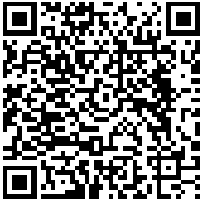
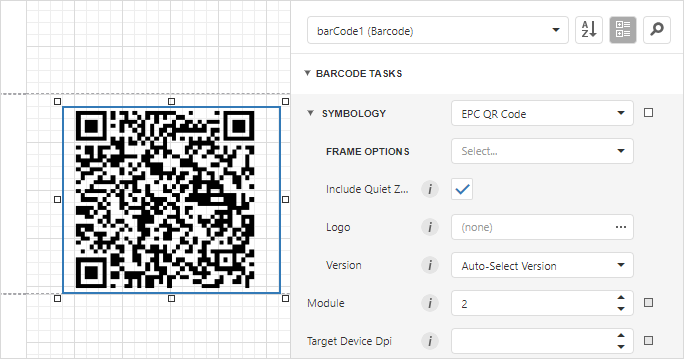
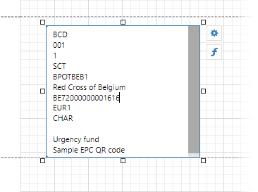
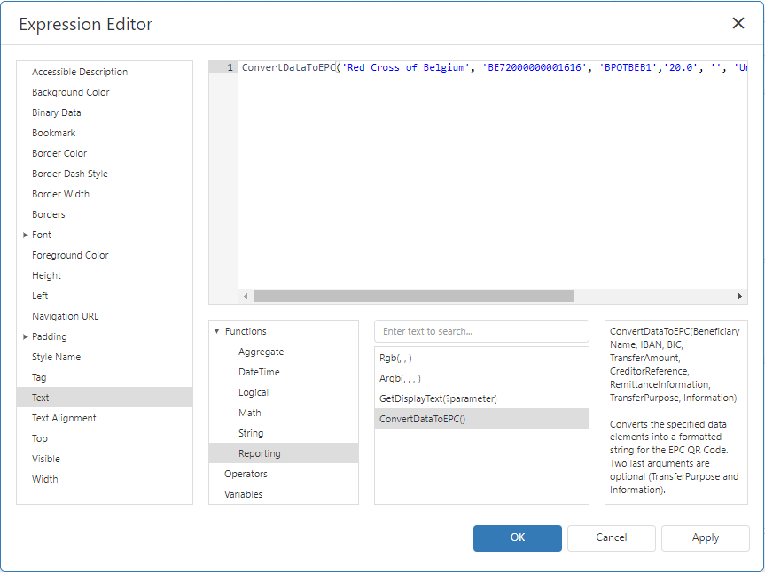
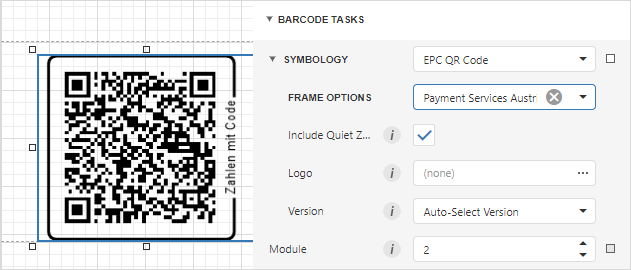

# EPC QR Code

An EPC QR Code (European Payments Council Quick Response Code) is a two-dimensional barcode used to initiate a [SEPA credit transfer (SCT)](https://www.europeanpaymentscouncil.eu/what-we-do/sepa-credit-transfer). The following guideline contains general information about this type of barcode and defines the data format for EPC QR Codes: [Quick Response Code - Guidelines to Enable the Data Capture for the Initiation of a SEPA Credit Transfer](https://www.europeanpaymentscouncil.eu/sites/default/files/kb/file/2022-09/EPC069-12%20v3.0%20Quick%20Response%20Code%20-%20Guidelines%20to%20Enable%20the%20Data%20Capture%20for%20the%20Initiation%20of%20an%20SCT_0.pdf).



## Add a Bar Code to a Report

1. Drag the **Barcode** item from the report controls toolbox tab and drop it onto the report. 

    

2. Set the control’s **Symbology** property to **EPC QR Code**. 

    

3. Specify [common](add-bar-codes-to-a-report.md) barcode properties and properties [specific](#specific-properties) to **EPC QR Code**.

## Specific Properties

- **Auto Module**

    Gets or sets whether the Module property value should be calculated automatically based on the barcode size.

- **Version**

    Gets or sets the bar code’s size.

- **Include Quiet Zone**

    Gets or sets whether to add a blank space around the QR code.

- **Logo**

    Specifies the image that overlays the QR code.

- **Frame Options**

    Gets or sets the [frame for QR codes](add-bar-codes-to-a-report.md#frames-for-qr-codes).

## Specify the Data

EPC QR Codes require data in a specific format. For more information, refer to the following European Payments Council guideline: [Quick Response Code - Guidelines to Enable the Data Capture for the Initiation of a SEPA Credit Transfer](https://www.europeanpaymentscouncil.eu/sites/default/files/kb/file/2022-09/EPC069-12%20v3.0%20Quick%20Response%20Code%20-%20Guidelines%20to%20Enable%20the%20Data%20Capture%20for%20the%20Initiation%20of%20an%20SCT_0.pdf).

You can specify the barcode data in the following ways:

### The Text property.

Pass the data string to Text property. Each data element should be on a new line. Double-click the control to specify the content (editors in the Property grid do not support multi-line text):



In the image above, the following data elements are specified:

| Data Element   |      Value      |
|----------|-------------|
| Service Tag:|  BCD | 
| Version:	 |    001   | 
| Encoding: | 1 |  
| Identification:|  SCT | 
| BIC:	 |   BPOTBEB1   | 
| Beneficiary Name: | Red Cross of Belgium |
| IBAN: | BE72000000001616 |
| Transfer Amount:|  EUR1 | 
| Transfer Reason:|    CHAR   | 
| Creditor Reference: | Empty line |
| Remittance Information: | Urgency fund  |
| Information: | Empty line |


This field is bindable. For more information on data binding, review the following help topic: [Bind Report Controls to Data](../bind-controls-to-data.md).

### The ConvertDataToEPC function.

Use the `ConvertDataToEPC` function from the Expression Editor to bind to the `Text` property.

You can specify the data as shown below:

```
ConvertDataToEPC('Red Cross of Belgium', 'BE72000000001616', 'BPOTBEB1','20.0', '', 'Urgency fund', 'CHAR', 'Sample EPC QR code')
```



You can not change the default values for Version and Encoding with this function. The default value for the Version data element is `002` and `UTF-8` for the Encoding.

## Display a “Zahlen mit Code” Frame

You can also apply a frame with the words “Zahlen mit Code” (to the right from the bottom to the top) to an EPC QR Code. The frame is used to highlight the function of the codes and to secure the identification. For more information, refer to the following Payment Services Austria (PSA) document: [Application of QR-Code for initiating of credit transfers](https://zv.psa.at/de/download/qr-code/339-qr-code-und-bcd-definition-3-en/file.html).

This frame already contains predefined settings according to the standard. To set this frame, go to Behavior → Symbology → FrameOptions, and select **Payment Services Austria Frame**.


