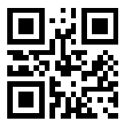
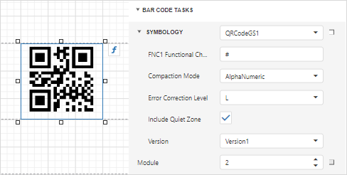

# GS1 QR Code

**GS1 QR Code** is a variant of the [QR Code](https://en.wikipedia.org/wiki/QR_code) symbology that conforms to [GS1 General Specification](https://www.gs1.org/standards/barcodes-epcrfid-id-keys/gs1-general-specifications).

## Add the Barcode to a Report

1. Drag the **Barcode** item from the report controls toolbox tab and drop it onto the report. 

    

2. Set the control’s **Symbology** property to **QR Code GS1**. 

    

3. Specify [common](add-bar-codes-to-a-report.md) barcode properties and properties [specific](#specific-properties) to **GS1 QR Code**.

## Specific Properties

In the [property grid](../../report-designer-tools/ui-panels/properties-panel.md), expand the **Symbology** list and specify the following properties specific to **GS1 QR Code**:

* **Compaction Mode**

    Specifies whether numeric, alpha-numeric or byte information should be used as the barcode's data.
	
* **Error Correction Level**

    Specifies the amount of redundancy built into the barcode's coding, to compensate for calculation errors.

* **FNC1 Functional Character**

    A substring/character that serves as the placeholder for the FNC1 functional character.

* **Logo**

    Specifies the image that overlays the QR code.

* **Version**

    Specifies the barcode's size.

* **Frame Options**

    Gets or sets the [frame for QR codes](add-bar-codes-to-a-report.md#frames-for-qr-codes).
	