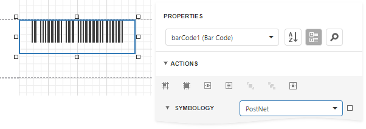

# PostNet

**PostNet** was developed by the United States Postal Service (USPS) to allow faster mail sorting and routing. **PostNet** codes are the familiar and unusual looking barcodes often printed on envelopes and business return mail.

Unlike most other barcodes, in which data is encoded in the width of the bars and spaces, **PostNet** actually encodes data in the height of the bars. That's why all the bars are of the same width, but not the same height.

## Add the Barcode to a Report

1. Drag the **Barcode** item from the report controls toolbox tab and drop it onto the report. 

    

2. Set the control’s **Symbology** property to **PostNet**. 

    

3. Specify [common](add-bar-codes-to-a-report.md) barcode properties.