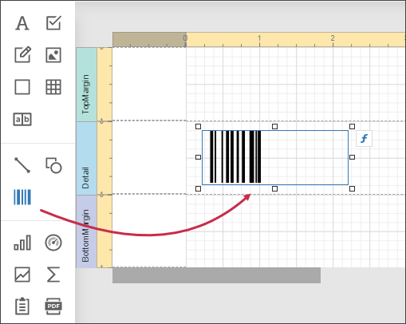
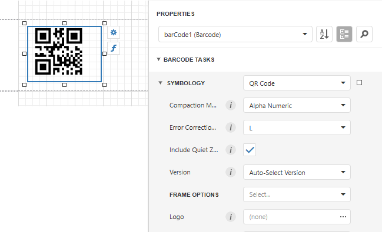

# QR Code

A **QR Code** (**QR** is the abbreviation for **Quick Response**) is a two-dimensional code, readable by **QR** scanners, mobile phones with a camera, and smartphones. **QR Code** can encode textual, numeric and binary data.

## Add the Barcode to a Report

1. Drag the **Barcode** item from the report controls toolbox tab and drop it onto the report. 

    

2. Set the control’s **Symbology** property to **QRCode**. 

    

3. Specify [common](add-bar-codes-to-a-report.md) barcode properties and properties [specific](#specific-properties) to **QRCode**.

## Specific Properties

In the [property grid](../../report-designer-tools/ui-panels/properties-panel.md), expand the **Symbology** list and specify the following properties specific to **QRCode**:

* **Compaction Mode**

    Specifies whether numeric, alpha-numeric or byte information should be used as the barcode's data.
	
* **Error Correction Level**

    Specifies the amount of redundancy built into the barcode's coding, to compensate for calculation errors.

* **Logo**

    Specifies the image that overlays the QR code.

* **Version**

    Specifies the barcode's size.
	
* **Frame Options**

    Gets or sets the [frame for QR codes](add-bar-codes-to-a-report.md#frames-for-qr-codes).