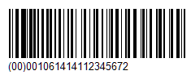
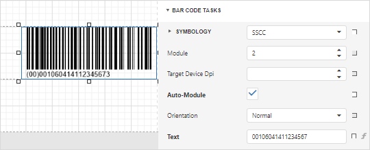

# Serial Shipping Container Code (SSCC)

The **Serial Shipping Container Code** (SSCC) is the GS1 Identification Key used to identify a logistic unit.
This unique identifier is composed of an Extension Digit, a GS1 Company Prefix, a Serial Reference, and a Check Digit.

## Add the Barcode to a Report

1. Drag the **Barcode** item from the report controls toolbox tab and drop it onto the report. 

    

2. Set the control’s **Symbology** property to **SSCC**. 

    

3. Assign a numeric value composed of 17 digits to the **Text** property. If the numeric value contains less than 17 digits, it is padded with zeros at the beginning so that the string value of the **Text** property contains exactly 17 characters. A numeric value with 17 digits is left intact. If 18 digits are specified, the last digit is truncated. A value with more than 18 digits causes an error.

4. Specify [common](add-bar-codes-to-a-report.md) barcode properties.