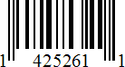
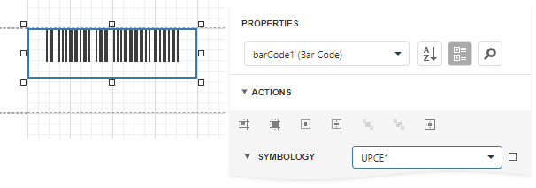

# UPC-E1

**UPC-E** is a kind of **UPC-A**, which allows a more compact barcode by eliminating "extra" zeros. Since the resulting **UPC-E** barcode is about half the size of the **UPC-A** barcode, **UPC-E** is generally used on products with a very small packaging where a full **UPC-A** barcode does not fit.

The **UPC-E1** is a variation of **UPC-E** code with the number system set to "**1**". In the human readable string of the barcode the first digit signifies the number system (always **1** for this code type), the last digit is the check digit of the original **UPC-A** code.

In the example below, the original **UPC-A** code is "**14210000526**". We should remove the leading "**1**" when assigning the string to the control's property, since the code format itself implies its presence. The checksum digit (**1**) is calculated automatically, and the symbology algorithm transforms the rest of the numeral string. The result is **425261**, and it is encoded along with the number system prefix and the check digit into the scanner-readable form.

Not every **UPC-A** code can be transformed into the **UPC-E1** (it must meet special requirements).

## Add the Barcode to a Report

1. Drag the **Barcode** item from the report controls toolbox tab and drop it onto the report. 

    

2. Set the control’s **Symbology** property to **UPCE1**. 

    

3. Specify [common](add-bar-codes-to-a-report.md) barcode properties.