---

title: Check Box
author: Anna Vekhina
---
# Check Box

The **Check Box** control displays the checkbox's state.

You can add this control by dragging the **Check Box** item from the [Toolbox](../../report-designer-tools/toolbox.md) onto the report's area.

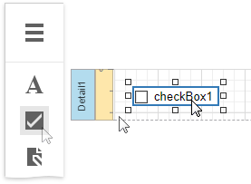

Use one of the following properties to set the checkbox's state:

* **Checked** - indicates whether the checkbox is selected (displays a check mark) or not (is empty).
* **Check State** - specifies one of the following checkbox states:	

    | Icon | Check State |
    |---|---|
    |  | Unchecked |
     | Checked|
    | |Indeterminate

The **Text** property specifies the checkbox's caption. You can double-click the checkbox to invoke its in-place editor and type the desired text.

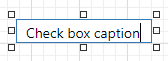

## Bind to Data

You can [bind](../bind-controls-to-data.md) the **Check State** property to a data field obtained from a report's data source. Switch to the [Properties](../../report-designer-tools/ui-panels/properties-panel.md) panel, expand the **Check Box Tasks** category and click the **Check State** property's marker. Select **Check State Expression** from the popup menu. Then select a data field in the invoked [Expression Editor](../../report-designer-tools/expression-editor.md).

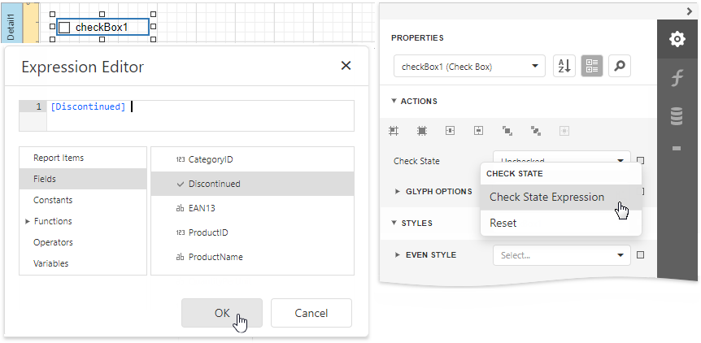

The data field value determines the checkbox state in the following manner:

* **True** or **1** activates the **Checked** state;
* **False** or **0** activates the **Unchecked** state;
* Any other value activates the **Indeterminate** state.

In the same way, click the **Text** property's marker, select **Text Expression**, then select a data field or construct a complex binding expression that involves two or more data fields.

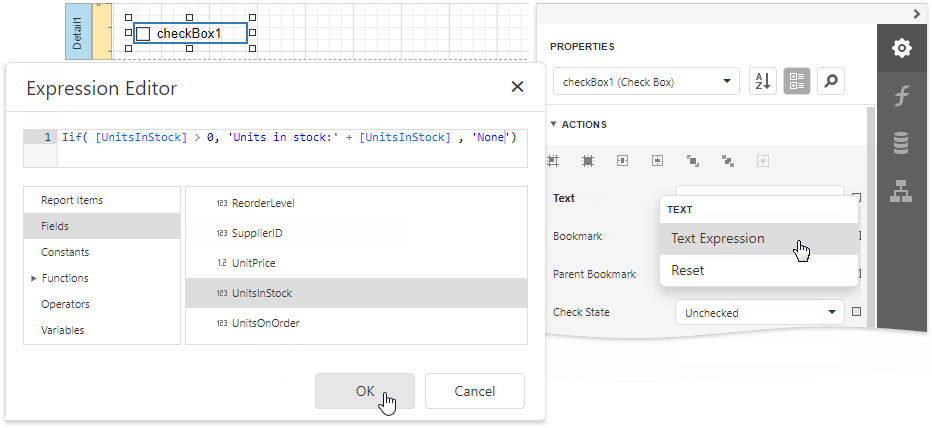

You can also drag and drop a Boolean type data field from the [Field List](../../report-designer-tools/ui-panels/field-list.md) to create a new checkbox bound to this field.

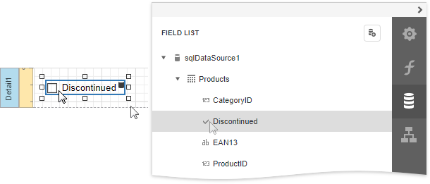

See the [Bind Report Controls to Data](../bind-controls-to-data.md) topic to learn more about creating data-aware controls.

## Interactivity
 
Set the **Edit Options** | **Enabled** option to **Yes** to enable [changing the checkbox state](../../provide-interactivity/edit-content-in-print-preview.md) in Print Preview.

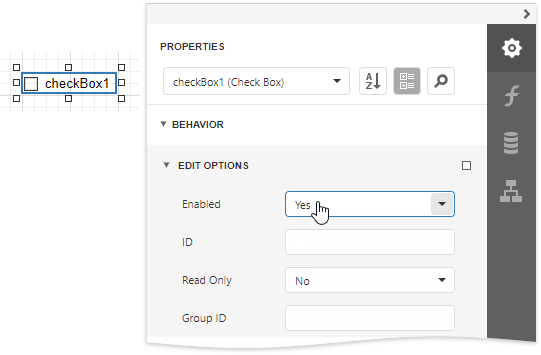

The **Group ID** setting defines the checkbox's behavior in Print Preview:

* When you set this property to an empty string value, a checkbox can be switched to either the "checked" and "unchecked" state independently on other available check boxes.
	
	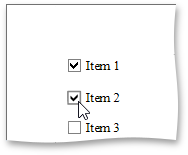

* Otherwise, the field editor behaves like a radio button, and editors that have the same ID belong to a single logical group (that is, only one option can be selected in a group at a time).

## Glyph Customization

The **Glyph Options** property provides access to glyph settings.

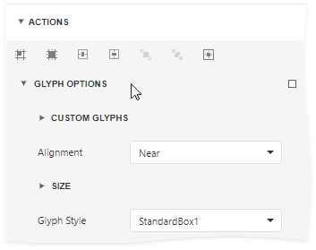

* **Alignment** - specifies the glyph's alignment within the control.

    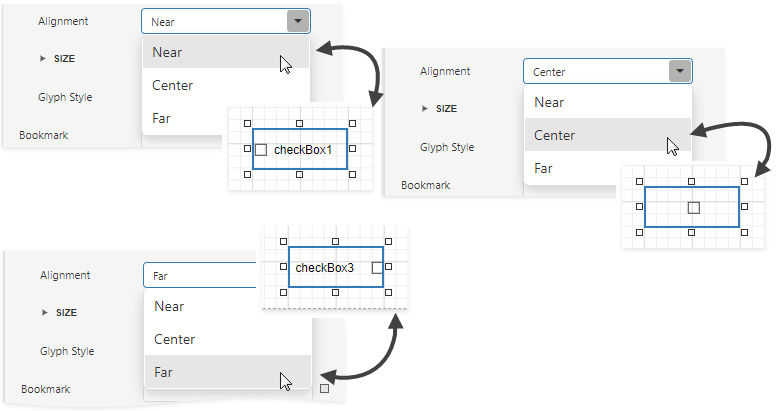

* **Size** - specifies the glyph size.

* **Glyph Style** - specifies a predefined glyph style.

    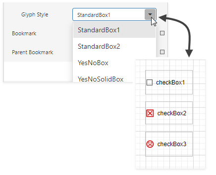
    
* **Custom Glyphs** - specifies a custom glyph image for each checkbox state (Checked/Unchecked/Indeterminate).

    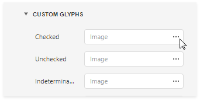
    
