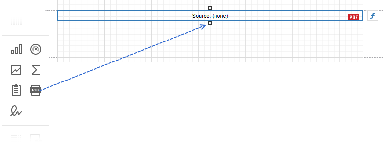
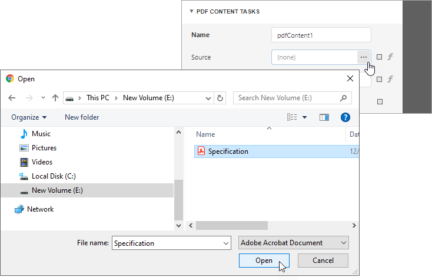

# PDF Content

The **PDF Content** control allows you to render PDF file content in two ways:

* *Default*. Render each PDF file page as a separate report page.
    
    

* Embed PDF content into a report.

    

    Refer to the following documentation section for more details: [Embed PDF File Content into a Report](#embed-pdf-file-content-into-a-report).

## Add the PDF Content Control to a Report

Drop the **PDF Content** item from the Toolbox onto a [band](../../introduction-to-banded-reports.md) on the design surface.

## Specify PDF Content

Use one of the following methods:

* [Specify binary PDF data](#specify-pdf-data)

    This data is stored in the report file. The source of this data does not need to be available when the report is rendered.

* [Specify a reference to a PDF document](#specify-a-reference-to-a-pdf-document)

    The reference to the document is stored in the report definition file. The referenced document should be available when the report is rendered.

### Specify PDF Data

Select the **PDF Content** control, navigate to the [Properties panel](../../report-designer-tools/ui-panels/properties-panel.md), click the **Source** property's ellipsis button, and select a PDF file.

When users save a report, the **Source** property value persists in the report file.

You can also use [report parameters](../../use-report-parameters.md) to conditionally specify the **Source** property value or bind the property to a data source field. Refer to the following section for details: [Use Expressions](#use-expressions).

### Specify a Reference to a PDF Document

Select the **PDF Content** control, navigate to the [Properties panel](../../report-designer-tools/ui-panels/properties-panel.md), and assign a path to a PDF file to this property.

You can also use [report parameters](../../use-report-parameters.md) to conditionally specify the **Source Url** property value or bind the property to a data source field. Refer to the following section for details: [Use Expressions](#use-expressions).

When users save a report, the URL or path specified in the **Source URL** property is included in the report file. The PDF document should be available at the specified location when a report is printed or rendered in Preview.

The **Source Url** property value takes precedence over the **Source** property value. If you specify both properties, **PDF Content** includes the content specified by **Source Url**. If the file specified in the **Source Url** property cannot be loaded, the PDF data from the **Source** property is used.

### Use Expressions

Select the **PDF Content** control and navigate to the [Properties panel](../../report-designer-tools/ui-panels/properties-panel.md). Click the **f** symbol right to the **Source** or **Source URL** property.

Use the invoked **Expression Editor** to create an expression that identifies the source of a PDF file.

## Embed PDF File Content into a Report

[Add](#add-the-pdf-content-control-to-a-report) the **PDF Content** control to a report, [specify](#specify-pdf-content) a PDF file location, and disable the control's **Generate Own Pages** property.

### Use Cases

* Create a report with PDF file content and headers / footers that are printed on PDF file pages.

* Print pictures, bar codes, page numbers, a report watermark, and other elements over the content of a PDF file.

* Create a report document with paper kind that differs from PDF pages paper kind. Refer to the following section for instructions: [Fit PDF File's Page Size to Report's Page Size](#fit-pdf-files-page-size-to-reports-page-size).

* Append PDF file content to report content and add sequential numbering to all report pages. For this, add PDF file content as a subreport to your report as described in the following section: [Fit PDF File's Page Size to Report's Page Size](#fit-pdf-files-page-size-to-reports-page-size). Then, [add page numbers](../../add-navigation/add-page-numbers.md) to both the subreport and main report. 

* Design a pre-printed form and use PDF file as a watermark.

    If your PDF file contains one page, follow the steps below:
    
    1. Embed this page into a report's *Detail* band.
    2. Remove the report's margins to prevent duplication with PDF page margins.
    3. Adjust the page size to make it fit the entire *Detail* band.

    If your PDF file contains multiple pages, do the following:
    * Create a subreport for each of the pages. Follow the instructions in this section: [Fit PDF File's Page Size to Report's Page Size](#fit-pdf-files-page-size-to-reports-page-size). Use the **PDF Content** control's **Page Range** property to specify the PDF file page that should be included to a subreport.
    * Include each of these subreports to one report.

### Fit PDF File's Page Size to Report's Page Size

A PDF file and a report to which you embed PDF file content might have different paper kind. PDF file pages can also be generated with double margins: page margins and report margins. 

This section explains how to set the same paper kind for a report and its embedded PDF file and how to include only the PDF file's page margins to the report. The main idea is to create a subreport that includes PDF pages in embedded mode, and then, add this subreport to the main report that contains initial content.

1. Create a blank report. Set the report's **Paper Kind** property to the paper kind of the main report to which you want to embed PDF content.

2. Drop the **PDF Content** control from the **Toolbox** onto the created report's _Detail_ band, specify a PDF file source, and disable the control's **Generate Own Pages** property.

3. Remove the report's margins and adjust the **PDF Content** control size to make PDF content fit the entire *Detail* band.

    

4. Add the report as a subreport to your main report. Use the [Subreport](subreport.md) control with the **Generate Own Pages** property enabled.

    

    Open the main report's Preview to show the result.

## Limitations

* PDF content is displayed as an image in Preview. Users cannot select text in PDF content. To allow users to select text, export the report to PDF.

* You cannot add the **PDF Content** control to the following bands:
    * **Top Margin** / **Bottom Margin**
    * **Page Header** / **Page Footer**
    * **Group Header** / **Group Footer** bands (if their **Repeat Every Page** properties are enabled).
    * **Vertical Header** / **Vertical Detail** / **Vertical Total**