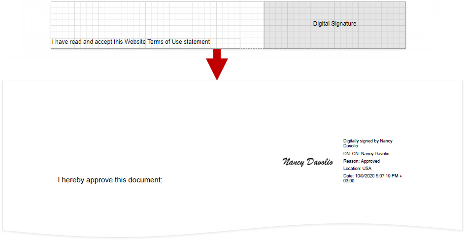
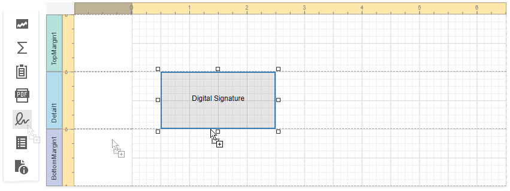

# PDF Signature

**PDF Signature** is a control that allows users to add a visual signature to a report exported to PDF.

The **PDF Signature** control visualizes the document signature information:

* Certificate name
* Distinguished name
* Location
* Signature date
* Signature reason

> [!TIP]
> For more information on how to create, export, and sign a report, refer to the following tutorial: [Reports with a Visual PDF Signature](../../create-reports/reports-with-visual-pdf-signature.md).

## Add a Signature Control to a Report

Drop the **PDF Signature** control from the **Toolbox** onto a report.

