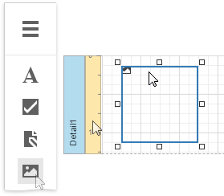
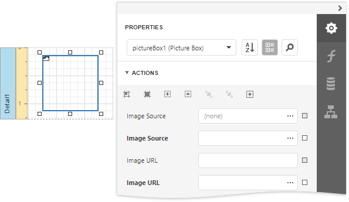
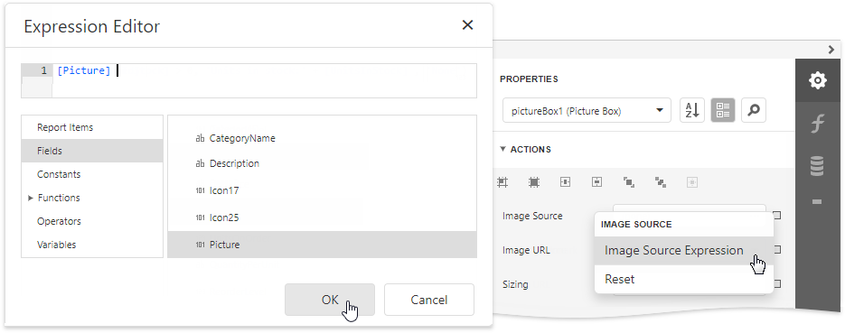
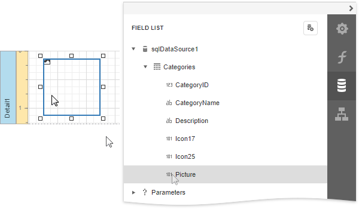
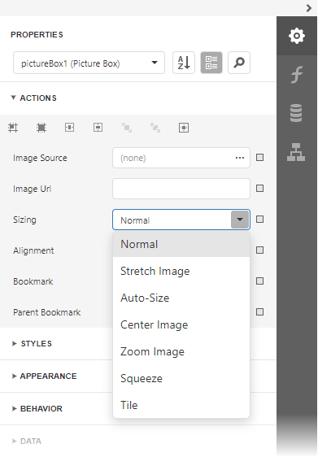
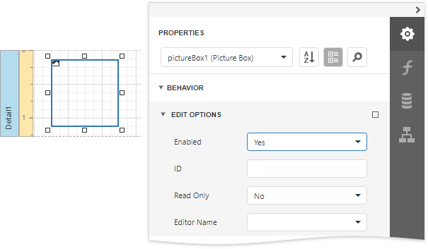
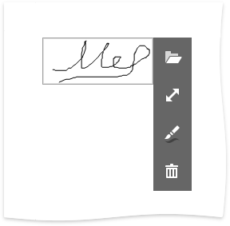

# Picture Box

## Overview
The **Picture Box** control allows you to embed _static_ (stored with the report) or _dynamic_ (obtained from a data source) images into a report.

To add this control to a report, drag the **Picture Box** item from the [Toolbox](../../report-designer-tools/toolbox.md) onto the report's area.

The Picture Box can display images with the following formats: BMP, JPG, JPEG, GIF, TIF, TIFF, PNG, ICO, DIB, RLE, JPE, JFIF, EMF, WMF, SVG.

Use the **Image Source** or **Image URL** property to specify the image the Picture Box displays. You can access these properties in the **Picture Box Tasks** category.

The specified image is [saved](../../save-reports.md) with the report if you use the **Image Source** property. If you use the **Image URL** property, only the path to the image is stored. 

## Bind to Data

You can use the Picture Box to display an image [dynamically obtained](../bind-controls-to-data.md) from a data source. Click the **Image Source** property's marker and select **Image Source Expression** from the popup menu. Then select the data field in the invoked [Expression Editor](../../report-designer-tools/expression-editor.md). You can use this editor to construct a binding expression that can include two or more data fields.

You can bind the **Image URL** property to data in the same way.

You can also drag and drop a field that contains image data from the [Field List](../../report-designer-tools/ui-panels/field-list.md) to create a new Picture Box bound to this field.

See the [Bind Report Controls to Data](../bind-controls-to-data.md) topic for more information about how to create data-aware controls.

## SVG Support Limitations
The Picture Box does not support the following SVG content:

* Gradient colors

* Text (you can convert text to curves as a workaround)

* Animations

* External .css styles

Export (except for PDF) has the following limitations:

* SVG images are converted to metafiles because document viewers may not support SVG format.

* SVG images are exported as PNG in the **Microsoft Azure** environment.

The **Medium Trust** permission level does not support SVG.

## Image Size Modes

Use the **Sizing** property to specify an image's position in the Picture Box. 

This control supports the following image size modes:

* **Normal**
    
    The image is displayed at the top left corner with its original dimensions. The image is clipped if it does not fit the control's boundaries. 

    

* **Stretch Image**

    The image is stretched or shrunk to fill the control's width and height.

    

* **Auto-Size**

    The control's dimensions are adjusted to the image's size.

    

* **Zoom Image**

    The image is resized proportionally without clipping it to fit the control dimensions.

    

* **Squeeze**

    The image is centered and shown full-size if the control dimensions exceed the image size. Otherwise, the image is resized to fit the control's boundaries.

    

* **Tile**

    The original image is replicated within the control starting from the top left corner. The replicated image is clipped if it does not fit the control's boundaries.

    

You can also use the **Image Alignment** property in the **Normal**, **Zoom Image** and **Squeeze** modes to specify the alignment in relation to the control's boundaries.

## Interactivity

You can add a possibility to load/change an image and/or draw a signature in a Picture Box when it is displayed in Print Preview. To do this, expand the **Behavior** category, select the **Edit Options** section and set the **Enabled** property to **Yes**.

Click the Picture Box in a previewed document and an editor invokes.

> [!TIP]
> You can draw borders for the Picture Box to make the editor visible in Print Preview, if an image is not specified.

Refer to the [Edit Content in Print Preview](../../provide-interactivity/edit-content-in-print-preview.md) and [Interactive E-Forms](../../create-reports/interactive-e-forms.md) topics to see how use this Picture Box mode.