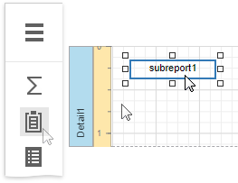

# Subreport

The **Subreport** control is used to embed other reports into the current report.

To add this control to the report, drag the **Subreport** item from the [Toolbox](../../report-designer-tools/toolbox.md) onto the report's area.

The Subreport control allows you to solve the following tasks:

* **Reuse reports**
	
	This can be useful if there is a particular report structure (template) that needs to be included in many reports, and the report must have consistent appearance and functionality. A good example is a report header that always contains the same information (the company information, logo, date, etc.).

* **Create master-detail reports**
	
	Another reason for using subreports is to create master-detail reports (reports with hierarchically linked data). For more details on this, see [Master-Detail Reports with Subreports)](../../create-reports/master-detail-reports-with-subreports.md).

* [Merge Reports](../../merge-reports.md)

You can use an already existing report in the report storage as a report source. Select the Subreport control, open the **Subreport Tasks** category, expand the **Report Source URL** property's drop-down list and select the required report.

Double-clicking a subreport opens its associated report in a new Report Designer tab.