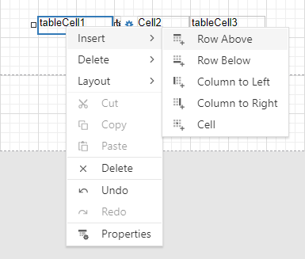
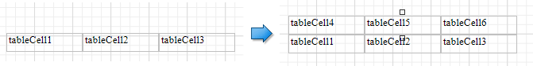
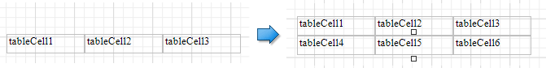
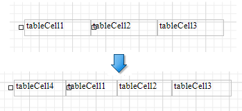
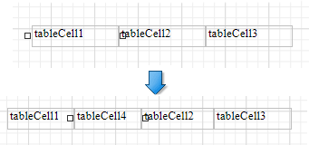
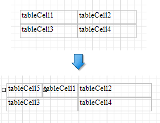
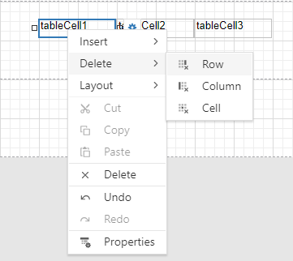
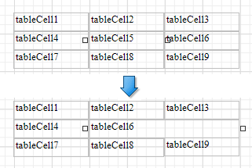
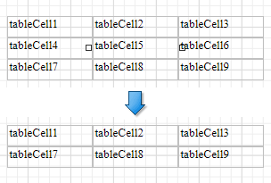
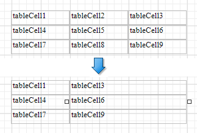

# Manage Table Structure

## Insert Table Elements

Use **Insert** commands from the table's context menu to add new rows and columns. The added cells inherit the source cells' size and appearance settings.

* **Insert Row Above**
    
    Inserts a row above the current cell and shifts the existing rows up if there is enough space above the table (otherwise, shifts the existing rows down).

    

* **Insert Row Below**

    Inserts a row below the current cell and shifts the existing rows down. This command increases the band height to accommodate all the rows if there is not enough space under the table.

    

* **Insert Column to Left**

    Inserts a new column to the left of the current cell and shifts the leftmost columns to the left (otherwise, shifts these columns to the right). 

    

* **Insert Columns to Right**

    Inserts a new column to the right of the current cell and shifts the rightmost columns to the right. This command decreases all columns' width proportionally to accommodate all the columns if there is not enough space to the right of the table.

    

* **Insert Cell** 

    Divides the current cell width in half and inserts a new cell to the left. The added cell copies the source cell's appearance settings.

    

## Delete Table Elements

Use **Delete** commands from the table's context menu to remove table elements.

* **Delete Cell**
	
    Deletes a table cell and stretches the next cell to occupy the remaining space. If this cell is the last in the row, the previous cell is stretched.

    

* **Delete Row**

    Deletes a row and shifts the existing rows up.

    

* **Delete Column**

    Deletes a column and stretches the next column to the left. If this column is the last in the table, the previous column is stretched.

    

