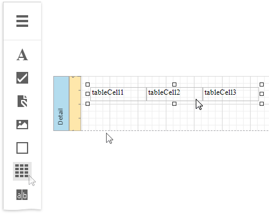
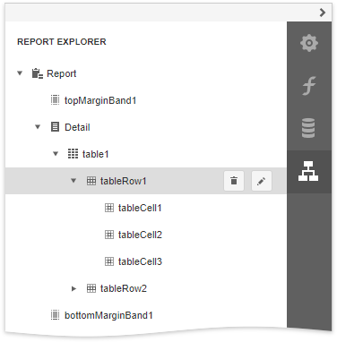
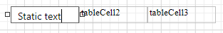
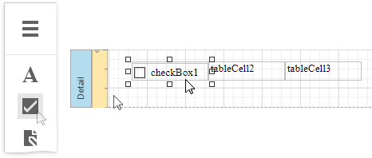

# Table Overview

The **Table** control displays information in a tabular format and allows you to create [table reports](../../create-reports/table-reports.md).

You can add a table control by dragging the **Table** item from the [Toolbox](../../report-designer-tools/toolbox.md) onto the report's area.

The table control contains one or more rows. Each row contains one or more cells. See the [Report Explorer](../../report-designer-tools/ui-panels/report-explorer.md) for a table structure example.

You can double-click the cell to invoke its in-place editor and type the desired static text.

You can adjust the font size of a cell's static text to fit into the cell's boundaries. Use the **Fit Text to Bounds** command from the cell's context menu.

Refer to [Bind Table Cells to Data](bind-table-cells-to-data.md) to learn about providing dynamic content to table cells.

A table cell is like an [Label](../use-basic-report-controls/label.md) control - it provides the same options for text formatting, alignment, appearance, interactivity, etc. 

You can also make a table cell act as a container for other report controls by dropping the required control from the toolbox on this cell.

If a table cell includes only one control, you can right-click this control and use the **Fit Bounds to Container** command in the context menu. This command resizes the control so that it occupies all the available cell space (excluding borders).

You can assign different [visual styles](../../customize-appearance/report-visual-styles.md) for even and odd table rows to improve readability.